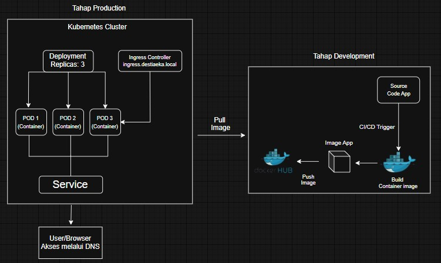
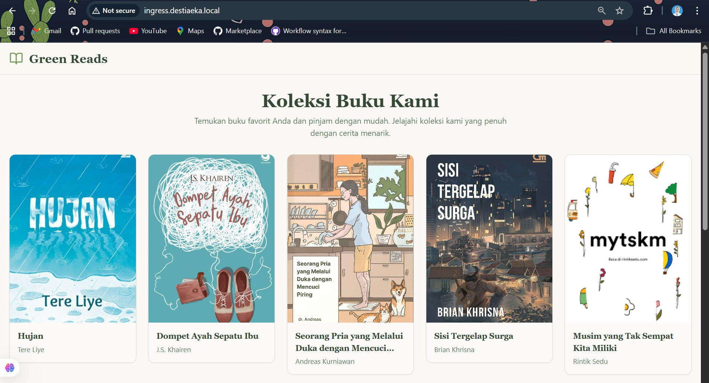
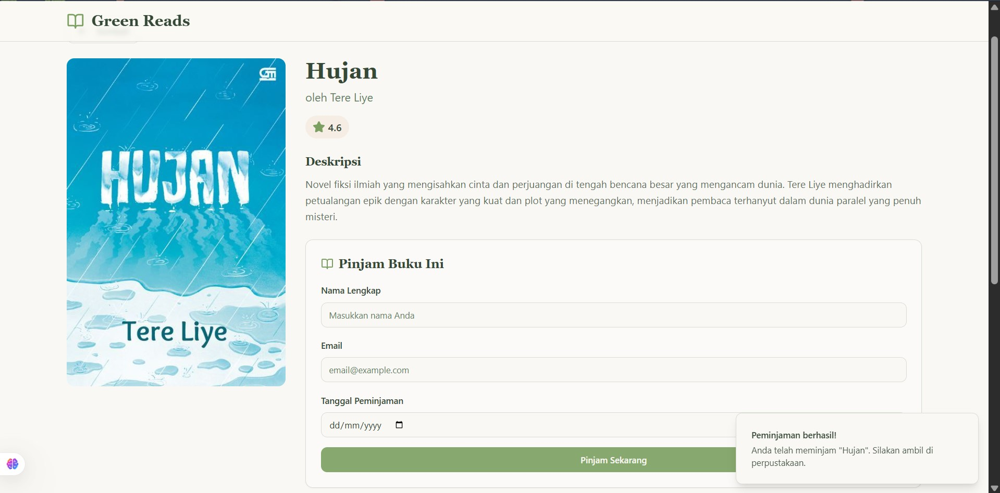
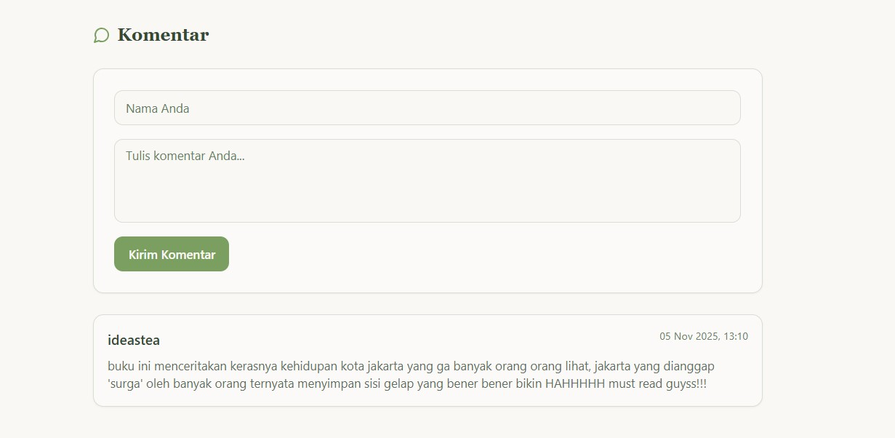

# 🚀 Book Review Web — Production Deployment Guide

---
<p align="center">
  
</p>

🐳 Dockerfile — Structure & Explanation
Here is an example of a Dockerfile structure used to build an application image:

```dockerfile
# Base Image
FROM node:18-alpine AS builder

# Working Directory
WORKDIR /app

# Copy package.josn & install dependencies
COPY package*.json ./
RUN npm install

# Copy all project & build image
COPY . .
RUN npm run build

# MUlti Stage
FROM nginx:alpine

# Copy the build results from the previous step to the Nginx directory.
COPY --from=builder /app/dist /usr/share/nginx/html

# Expose port 
EXPOSE 80

# Run Nginx
CMD ["nginx", "-g", "daemon off;"]
```

## 🏗️ Build & Push Docker Image
1. Build Image Locally
```
docker build -t destiaeka/booksreview:latest .
```
2. Run Container
```
docker run -d --name booksreview -p 80:80 destiaeka/booksreview:latest
```
3. Push to Docker Hub
```
docker push destiaeka/booksreview:latest
```

## ☸️ Kubernetes Manifest

For deployments in a K3s cluster, two main files are used:
- Deployment → Runs Pods with container images
- Service → Exposes the application so it can be accessed from outside the cluster
To expose, I use ingress.

To run the manifest file, enter the following command:
```
kubectl apply -f deployment.yml
kubectl apply -f service.yml
kubectl apply -f ingress.yml
```
```
[ides@103-160-37-103 ~]$ kubectl get all
NAME                                          READY   STATUS    RESTARTS   AGE
pod/booksreview-deployment-7d7b5b6f64-6b69j   1/1     Running   0          26s
pod/booksreview-deployment-7d7b5b6f64-fxrkg   1/1     Running   0          27s
pod/booksreview-deployment-7d7b5b6f64-p5m84   1/1     Running   0          26s

NAME                          TYPE        CLUSTER-IP     EXTERNAL-IP   PORT(S)   AGE
service/booksreview-service   ClusterIP   10.43.60.68    <none>        80/TCP    27s
service/kubernetes            ClusterIP   10.43.0.1      <none>        443/TCP   21h

NAME                                     READY   UP-TO-DATE   AVAILABLE   AGE
deployment.apps/booksreview-deployment   3/3     3            3           28s
```
```
[ides@103-160-37-103 ~]$ kubectl get ingress
NAME                  CLASS     HOSTS                     ADDRESS          PORTS   AGE
booksreview-ingress   traefik   ingress.destiaeka.local   103.160.37.103   80      43s
```

## ⚙️ CI/CD Workflow (GitHub Actions + Lovable Cloud)
This project integrates with GitHub Actions to automate the following processes:
- Build Docker images
- Push to Docker Hub
- Automatically deploy to a Kubernetes cluster

---



---
